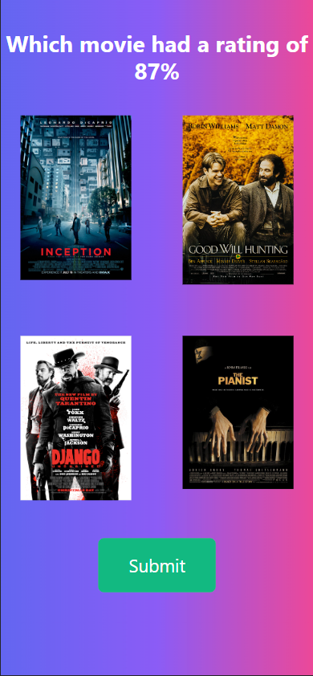

# Movie Quiz

## Description

The movie quiz is a short app that lets you guess the Rotten Tomatoes score of a popular movie. When you guess correct or incorrect you are redirected to an Info page that shows the YouTube Trailer of the correct movie. The game also calculates scores and stores them to localStorage and displays those at the end.

## Acceptance Criteria

GIVEN I am playing the movie-quiz game  
WHEN I load the homepage  
THEN it loads properly

WHEN I press Start  
THEN the game begins  
AND the first question pops up  
AND I am presented with a Rotten Tomatoes score and a list of 4 movies that it could possibly be

WHEN I select an answer  
AND press Submit  
THEN a review page pops up with an iframe of the YouTube trailer and whether or not you got the question right

WHEN you hit Continue  
THEN the next question loads  
OR the end of the quiz if you are at the final question

WHEN the end page of the quiz loads  
THEN I see a list of High scores from LocalStorage

## Screenshots

## Contributing

Project was made collaboratively by:  
[Nick Hanson](https://github.com/hansonnick25)  
[Abdul Samed Alhassan](https://github.com/abdulsamedtma)  
[Jo Giancola](https://github.com/jdgiancola)

## License

[MIT](https://choosealicense.com/licenses/mit/)

## Deployed Site

[Movie Quiz](https://hansonnick25.github.io/movie-quiz/)
